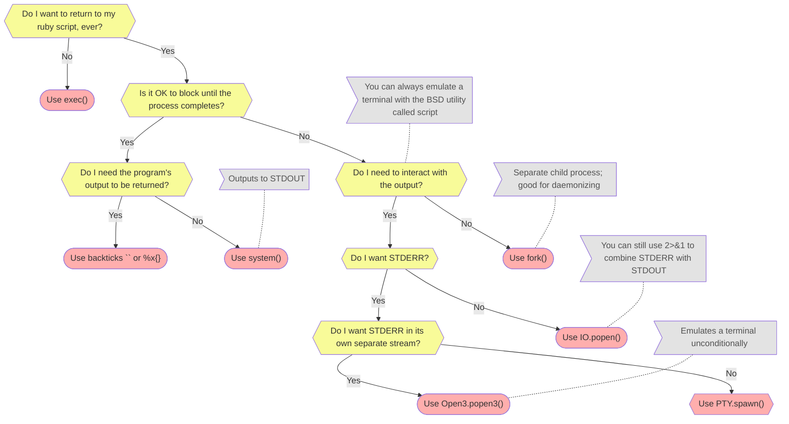

# Ruby

### How to launch a subprocess

```mermaid
flowchart TD

A{{"Do I want to return to my ruby script, ever?"}} -- No --> B(["Use exec()"])
A -- Yes --> C{{"Is it OK to block until the process completes?"}}
C -- Yes --> D{{"Do I need the program's output to be returned?"}}
D -- Yes --> E(["Use backticks `` or %x{}"])
D -- No --> F(["Use system()"])
C -- No --> H{{"Do I need to interact with the output?"}}
H -- Yes --> J{{"Do I want STDERR?"}}
H -- No --> I(["Use fork()"])
J -- Yes --> L{{"Do I want STDERR in its own separate stream?"}}
J -- No --> K(["Use IO.popen()"])
L -- Yes --> M(["Use Open3.popen3()"])
L -- No --> N{{"Use PTY.spawn()"}}

O>"Outputs to STDOUT"] -.- F
P>"You can always emulate a terminal with the BSD utility called script"] -.- H
Q>"Separate child process; good for daemonizing"] -.- I
R>"You can still use 2>&1 to combine STDERR with STDOUT"] -.- K
S>"Emulates a terminal unconditionally"] -.- M

classDef decision fill:#f8fb99;
classDef action fill:#ffaead;
classDef note fill:#ddd,opacity:0.9,font-weight:200;

class A,C,D,H,J,L decision;
class B,E,F,I,K,M,N action;
class O,P,Q,R,S note;
```
